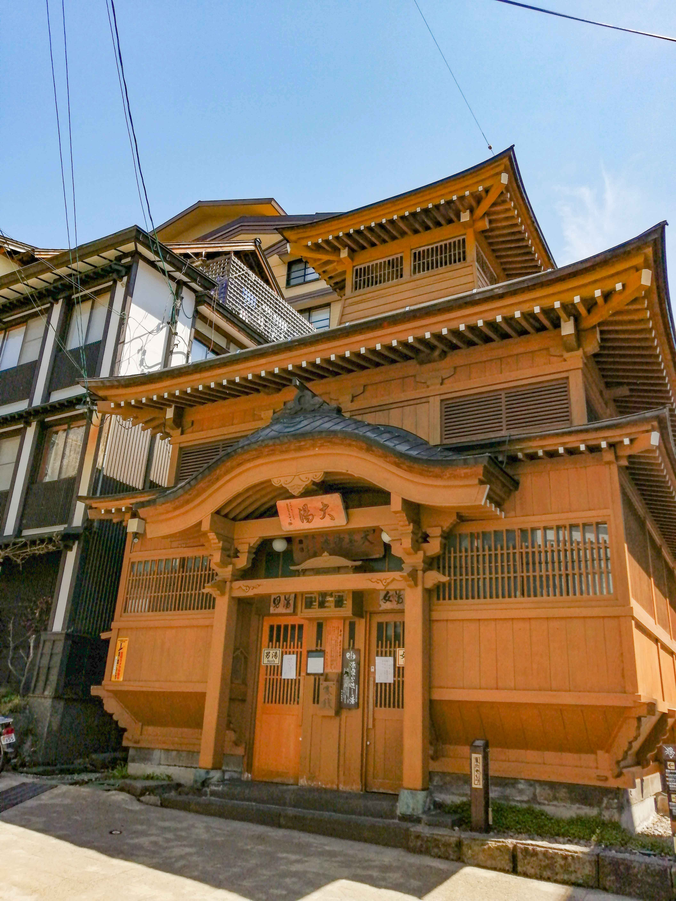

## Jigokudani

Jigokudani, literally means Hell valley, here we can watch adorable monkeys.\
I visited here in spring, it was not much cold that I couldn't see there monkeys bathing.

## Nozawa onsen

surrounded by mountain, historical onsen city. 

"Soto-yu" means outside bath, you can taste 13 spring bathing freely! 

be careful, some bath are extremely hot!